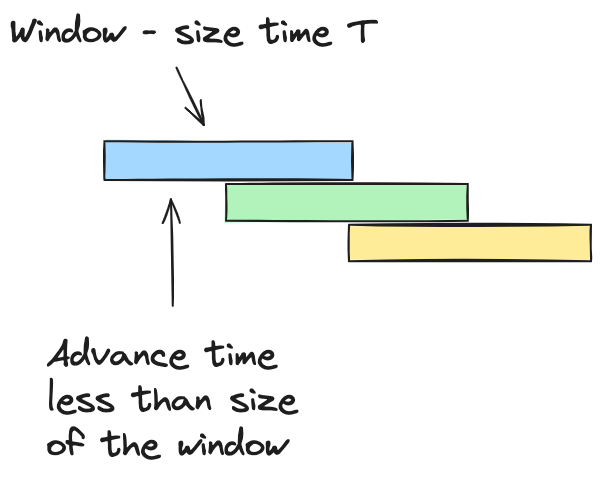
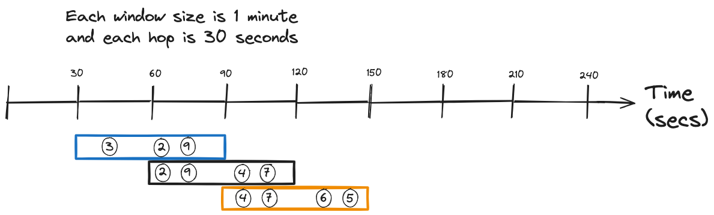
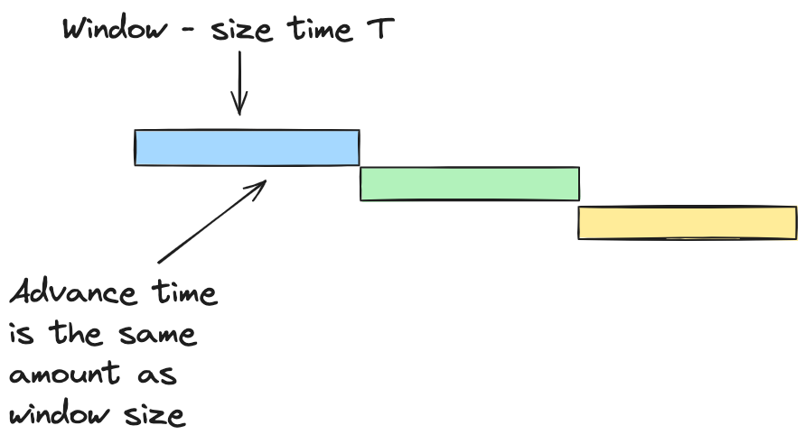
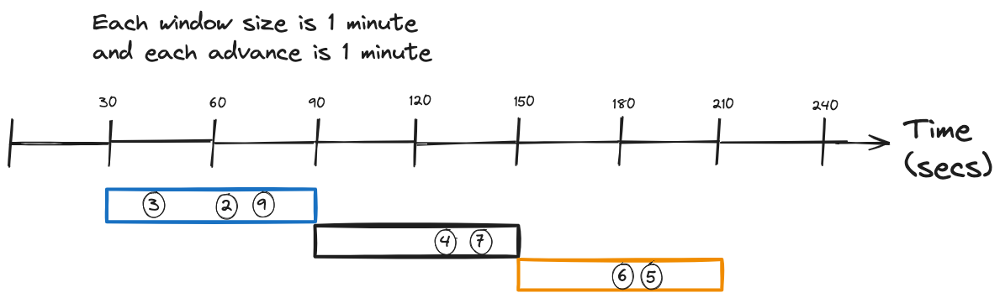
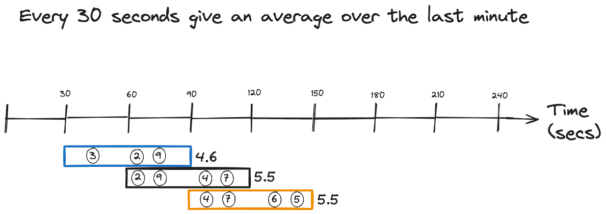
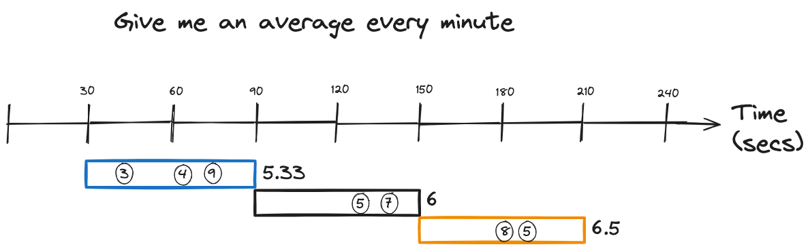

# Mastering Stream Processing - Hopping and Tumbling windows

In the first post of this series, we discussed what event streaming windowing is, and we examined in detail the structure of a windowed aggregate in Kafka Streams and Flink SQL.

In this post, we'll dive into two specific windowing implementations: hopping and tumbling windows.

## Hopping windows

A hopping window has a fixed time length, and it moves forward or \"hops\" at a time interval smaller than the window's length. For example, a hopping window can be one minute long and advance every ten seconds. The following illustration demonstrates the concept of a hopping window:

<figure>

<figcaption>Hopping windows have a fixed size with advances smaller than the length of the window</figcaption>
</figure>

So, from the illustration above, hopping windows can produce overlapping results. A hop forward can include results contained in the previous window. Let's look at another illustration demonstrating this concept:

<figure>

<figcaption>Hopping windows of one minute with a 30-second advance will share 30 seconds of data with the following window</figcaption>
</figure>

Walking through the picture:

1.  Window one starts at 12:00:00 PM and will collect data until 12:01:00 PM (end time is exclusive).

2.  At 12:00:30 PM, due to the thirty-second advance, window two starts gathering data.

3.  Window one and window two will share data for thirty seconds from the start of window two until the end of window one. The process continues with each window advance.

Let's show how you would implement a hopping window in Kafka Streams and Flink SQL.

## Kafka Streams hopping window

For a hopping windowed aggregation in Kafka Streams, you'll use one of the factory methods in the [TimeWindows](https://www.javadoc.io/static/org.apache.kafka/kafka-streams/3.6.1/org/apache/kafka/streams/kstream/TimeWindows.html) class:

::: formalpara-title
**A Kafks Streams hopping window example**
:::

``` java
KStream<String,Double> iotHeatSensorStream =
  builder.stream("heat-sensor-input",
    Consumed.with(stringSerde, doubleSerde));


iotHeatSensorStream.groupByKey()
      .windowedBy(
                  TimeWindows.ofSizeWithNoGrace(Duration.ofMinutes(1)) 
                             .advanceBy(Duration.ofSeconds(30)) 
                  )
        .aggregate(() -> new IotSensorAggregation(tempThreshold),
         aggregator,
         Materialized.with(stringSerde, aggregationSerde))
         .toStream().to("sensor-agg-output",
           Produced.with(windowedSerde, aggregationSerde))
```

1.  By using `TimeWindows.ofSizeWithNoGrace(Duration.ofMinutes(1))` sets the window size at one minute, the `withNoGrace` means Kafka Streams will drop any out-of-order records that would have been included in the window had they arrived in order. We'll get into grace periods more in the blog post on windowing time semantics.

2.  The `.advanceBy(Duration.ofSeconds(30)` call makes this a hopping window. It creates a window that is one minute in size and advances every ten seconds.

Next, let's move on to hopping windows with Flink SQL.

# Flink SQL hopping window

Note that Flink hopping windows can also be referred to as sliding windows. Kafka Stream offers a sliding window variant that behaves differently from its hopping window offering. So, for clarity, we'll only refer to Flink windows with an advance smaller than the window size as hopping windows.

::: formalpara-title
**Hopping window average with Flink SQL**
:::

``` sql
SELECT window_start,
       window_end,
       device_id,
       AVG(reading) AS avg_reading
FROM TABLE(HOP 
               (TABLE device_readings,   
                     DESCRIPTOR(ts),    
                     INTERVAL '30' SECONDS,  
                     INTERVAL '1' MINUTES  
               ))
GROUP BY window_start,
         window_end,
         device_id
```

1.  Specifying hopping windows by passing the `HOP` function to the `TABLE` function.

2.  The table you'll use as the source for the hopping window aggregation.

3.  The `DESCRIPTOR` is the column with the time attribute used for the window.

4.  This first `INTERVAL` is the amount of \"hop\" or advance of the window.

5.  The second `INTERVAL` is the size of the window.

Now, let's move on to tumbling windows.

# Tumbling windows

A tumbling window has a fixed length in size and has an advance that is the same amount of time as the size. Tumbling windows are considered a specialized case of hopping windows due to the advance equalling the window size.

<figure>

<figcaption>A tumbling window collects data for the window size, then "tumbles over" to start a new window.</figcaption>
</figure>

Since a tumbling window starts a new one when the previous one ends, they don't share any data. You won't find records from one window in another one; the following illustration helps clarify this process:

<figure>

<figcaption>Tumbling windows have an advance equal to the size of the window and tumble to start a new one with no overlap in data</figcaption>
</figure>

Stepping through this illustration

1.  Window one starts at 12:00:00 PM and will collect data until it ends. The endtime of the window is exclusive

2.  At 12:01:00 PM window two starts collecting data

3.  Since each window starts collecting data after the previous window ended, there are no shared results.

# Kafka Streams tumbling window

For tumbling windows in Kafka Streams you'll use [TimeWindows](https://www.javadoc.io/static/org.apache.kafka/kafka-streams/3.6.1/org/apache/kafka/streams/kstream/TimeWindows.html) class:

::: formalpara-title
**A Kafks Streams tumbling window example**
:::

``` java
KStream<String,Double> iotHeatSensorStream =
  builder.stream("heat-sensor-input",
    Consumed.with(stringSerde, doubleSerde));
  
iotHeatSensorStream.groupByKey()
      .windowedBy(
                  TimeWindows.ofSizeWithNoGrace(Duration.ofMinutes(1)) 
                  )
        .aggregate(() -> new IotSensorAggregation(tempThreshold),
         aggregator,
         Materialized.with(stringSerde, aggregationSerde))
         .toStream().to("sensor-agg-output",
           Produced.with(windowedSerde, aggregationSerde))
```

1.  Using `TimeWindows.ofSizeWithNoGrace(Duration.ofMinutes(1))` without the `.advanceBy` clause automatically makes this a tumbling window. Since you didn't specify an advance, Kafka Streams will add one equal to the size. You could add the `advanceBy` clause with the same amount of time if you choose to skip the shortened version.

# Flink SQL tumbling window

Tumbling windows in Flink SQL are defined similarly to the hopping variety, with a couple of differences

::: formalpara-title
**Tumbling window average with Flink SQL**
:::

``` sql
SELECT window_start,
       window_end,
       device_id,
       AVG(reading) AS avg_reading
FROM TABLE(TUMBLE 
               (TABLE device_readings,   
                     DESCRIPTOR(timestamp),    
                     INTERVAL '1' MINUTES  
               ))
GROUP BY window_start,
         window_end,
         device_id
```

1.  Specifying tumbling windows by passing the `TUMBLE` function to the `TABLE` function.

2.  The table you'll use as the source for the tumbling window aggregation.

3.  The `DESCRIPTOR` is the column with the time attribute used for the window.

4.  By passing a single `INTERVAL` parameter, Flink SQL will utilize this as the advance and the size.

You define tumbling windows in Flink SQL similarly to Kafka Streams in that you only provide one time paramater.

# Use cases

## Hopping Windows

Let's look at an illustration for the use case of hopping windows:

<figure>

<figcaption>Hopping window use case of collecting data for an aggregation for some time reported at intervals less than window</figcaption>
</figure>

So, from looking at this image, we could generalize hopping windows as \"every \<time-period of window advance\> give me \<aggregate\> over the last \<window size\> period\". From our examples here, it would be \"every 30 seconds, give me the average temp reading over the last minute\". So, any problem domain where you want to closely monitor changes over time or compare changes relative to the previous reading could be a good fit for the hopping window.

It's worth noting that Kafka Streams will emit periodic results before a window closes, while Flink SQL will only emit results when it's closed. I'll go into more details about this in the fourth installment of this blog series.

## Tumbling Windows

For the tumbling window, we have another illustration:

<figure>

<figcaption>Tumbling window use case collecting data for aggregation and reporting it at regular intervals</figcaption>
</figure>

This illustration for tumbling windows can be summarized as \"give me \<aggregate\> every \<window size period\>\" or restated to fit the examples in this post: \"give me the average temp reading over the last minute\". Since tumbling windows don't share any records, any situation requiring a unique count of events per window period would be a reason to use a tumbling window.

# Resouces

-   [Kafka Streams in Action 2nd Edition](https://www.manning.com/books/kafka-streams-in-action-second-edition)

-   [Apache Flink on Confluent Cloud](https://www.confluent.io/product/flink/)

-   [Flink SQL Windows](https://nightlies.apache.org/flink/flink-docs-release-1.18/docs/dev/table/sql/queries/window-tvf/#windowing-table-valued-functions-windowing-tvfs)

-   [Kafka Streams windowing documentation](https://docs.confluent.io/platform/current/streams/developer-guide/dsl-api.html#windowing)

