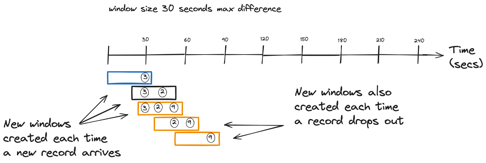

# Mastering Stream Processing - Sliding Windows and OVER Aggregations

In the third installment of this windowing blog series, you'll learn about sliding windows and a bit of SQL. In the previous post, we covered hopping and tumbling windows, both of which Kafka Streams and Flink SQL provide. In this installment, we will discuss sliding windows, supported by Kafka Streams and Flink SQL, or the logical equivalent in both. Let's jump into sliding windows.

# Sliding windows

[Sliding windows](https://kafka.apache.org/36/javadoc/org/apache/kafka/streams/kstream/SlidingWindows.html) in Kafka Streams combine attributes of the previous windows we've seen in this blog series. Like the hopping or tumbling variants, a sliding window has a fixed size determined by the maximum time difference between records. But record timestamps determine the start and end times of the window, like a session window. Another difference with the sliding window is that both start and end times are inclusive as opposed to only the start time as with the other windows.

As the window slides over the data, new records come into the front as old records drop off the back. You can think of a sliding window that continually \"slides\" over an event stream, with new records entering the front and older records falling out the back.

While you could emulate sliding windows in Kafka Streams by defining a hopping window with a 1MS advance, the sliding window has some distinct advantages. First, the sliding window start and end times are inclusive, unlike the hopping window, where only the start time is inclusive. Second, sliding windows are more efficient as they calculate each ***distinct*** window. A new window is created only when a record enters or drops out of the window. A hopping window with a small advance is less efficient as it will perform its calculation for every window regardless of whether the windows contain different events.

As each record arrives, Kafka Streams creates a new window, including any previous records that fit within the maximum time difference defined by the window. This \"look back\" feature is unique to the sliding window behavior. Let's look at an illustration of sliding windows in action:

<figure>

<figcaption>Sliding windows create a new window for new records, and when records drop out of a window</figcaption>
</figure>

So, from our simple illustration, we can see how incoming records create a new window and include previous records that fit within the (exclusive) time difference.

Here's how you define a Kafka Streams sliding window:


**Sliding windows in Kafka Streams**

``` java
KStream<String,Double> iotHeatSensorStream =
  builder.stream("heat-sensor-input",
    Consumed.with(stringSerde, doubleSerde));

iotHeatSensorStream.groupByKey()
      .windowedBy(
                  SlidingWindows.ofTimeDifferenceWithNoGrace(Duration.ofMinutes(1)) 
                  )
        .aggregate(() -> new IotSensorAggregation(tempThreshold),
         aggregator,
         Materialized.with(stringSerde, aggregationSerde))
         .toStream().to("sensor-agg-output",
           Produced.with(windowedSerde, aggregationSerde))
```

1.  Using a sliding window with a time difference of one minute, when a new record arrives, previous records within the time difference are included in the window.

Now, let's move on to FLink SQL.

# OVER Aggregation

While FLink SQL doesn't have an exact one-to-one match with the Kafka Streams sliding window, it does provide essentially the same functionality with [OVER aggregations](https://nightlies.apache.org/flink/flink-docs-release-1.18/docs/dev/table/sql/queries/over-agg/#over-aggregation). Using the `OVER` clause in Flink SQL allows you to perform an aggregation over a range of rows, but what makes it unique is that, unlike a `GROUP BY` aggregation, the `OVER` aggregation does not reduce the results; it includes all the rows in the aggregation range. Note that you could do something similar in Kafka Streams using the [Processor API](https://kafka.apache.org/36/documentation/streams/developer-guide/processor-api.html).

There's a subtle difference in the results of `GROUP BY` and an `OVER` aggregation with a `PARTITION BY`. The easiest way to show the differences between the two will be with illustrations. Consider the following table of data as the basis for our comparison:

<figure>

<figcaption>Table of temperature readings</figcaption>
</figure>

Now lets at the results of a `Group By` aggregation first:

<figure>

<figcaption>Group By Aggregates collapse the details into singular results</figcaption>
</figure>

The results here are what we've all come to expect: the original rows are reduced into a single row per location with the average reading. Now contrast that with the `OVER` approach:

<figure>

<figcaption>OVER Aggregates return all rows in the range</figcaption>
</figure>

The results of an `OVER (PARTITION BY…​)` aggregation contain all the rows of the range. Each row contains the same value for the average by location, but you have all the other information available to view. This demonstrates the differences between `Group By` and `OVER (PARTITION BY..)` aggregations. Both clauses group things together, but a `Partition By` does not combine the rows in the results; each row remains distinct. It's important to note here that altough results are shown here for each row in the table, it's only for demonstration purposes. An `OVER` aggregation only returns results for rows that fall into the specifed range.

So, in what may be an oversimplification, an `OVER` aggregation allows you to perform aggregates and group the results but still view the individual rows. While a `Group By` will collapse the rows and provide a single-row result per grouping.

Let's jump into an example query now. Let's say you have a fleet of IoT sensors deployed in different parts of a manufacturing process, and monitoring the temperature is essential to spot problems and keep the process running smoothly. So you'll want a query that will give you the average temps per location over the last minute:


**OVER Aggregation in Flink SQL**


``` sql
SELECT device_id, report_time,
   AVG(temp_reading) OVER (  
     PARTITION BY location   
     ORDER BY report_time  
      RANGE BETWEEN INTERVAL '1' MINUTE PRECEDING AND CURRENT ROW 
 ) AS one_minute_location_temp_averages 
FROM readings;
```

1.  The OVER clause

2.  Partitioning by the location

3.  Ordering results by the `report_time` column

4.  A range definition specifying the range to go back 1 minute in results

5.  The name the average calculation column

So, this query will give us a running average of temperatures grouped by region but all rows. You can also specify the range as a count of rows from the current row. In Flink SQL, the `ORDER BY` is required and only works with ascending time attributes. The [range defintions](https://nightlies.apache.org/flink/flink-docs-release-1.18/docs/dev/table/sql/queries/over-agg/#range-definitions) come in two forms:

1.  A `RANGE` interval dependant on the time attribute defined by the `ORDER BY` column

2.  A `ROW` interval, which is count-based and specifies how many rows the result will contain. A `ROW` interval looks like this: `ROWS BETWEEN N and CURRENT ROW`, including N+1 result rows (the N preceding rows plus the current row). The `CURRENT ROW` is the starting point for a specified range determined by the `PARTITION BY` clause.

The choice of which range definition to apply depends on your use case. The `RANGE` interval will drop older records as new records advance the window, but you'll always know the records in the aggregation are within a given time. The `ROW` ensures that you'll always have N number of records making up your computation.

Another point of consideration is that the `PARTITION BY` clause is optional. By leaving it off, you'll get an overall aggregation of records in the range vs. aggregations segmented by the partition column.

There's another way to express an `OVER` aggregation in Flink SQL using the `WINDOW` clause. Let's rework our `OVER` aggregation example to use this format.


**OVER aggregation using the WINDOW clause**


``` sql
SELECT location, reading, report_time,
 Avg(reading) OVER win as avg_temps, 
 FROM readings
 WINDOW win AS (   
    PARTITION BY location
    ORDER BY report_time
    RANGE BETWEEN INTERVAL '15' MINUTE PRECEDING AND CURRENT ROW
 );
```

1.  The Avg aggregation function over the readings

2.  Using the `WINDOW` clause to specify the window over a range of data

This query is the functional equivalent of the previous `OVER` aggregation example. So the question of \"which one\" naturally comes to mind, to which there are a couple of answers. First, the `WINDOW` form has a more explicit window definition, making it easier to understand. Second, defining the `OVER` aggregation this way opens the door to reusing the window definition for multiple aggregates. For example, consider you want to keep track of the maximum temperature and the average. You could do so with this query:


**OVER aggregation with a Window clause and multiple aggregations**


``` sql
SELECT location, reading, report_time,
 Avg(reading) OVER win as avg_temps,
 MAX(reading) OVER win as max_temp
 FROM readings
 WINDOW win AS (
    PARTITION BY location
    ORDER BY report_time
    RANGE BETWEEN INTERVAL '15' MINUTE PRECEDING AND CURRENT ROW
 );
```

So by explicitly using the `WINDOW` form, you can easily add more aggregations, but keep in mind this increases the state for Flink SQL to keep.

Finally, the `OVER` aggregation query is the basis for other analytical queries like the [Top-N](https://nightlies.apache.org/flink/flink-docs-release-1.18/docs/dev/table/sql/queries/topn/#top-n) query. I won't go into more detail about the `OVER` aggregation type of query now, but I'll have a post that goes deeper into it and other analytical queries soon.

## Comparing Sliding windows to OVER aggregations
At the blog's beginning, I mentioned that the Kafka Streams and Flink SQL `OVER` aggregation were logically similar. With the sliding window, when a new record arrives, Kafka Streams creates a new window for it, and there's a \"look back\" to see what records have timestamps within the max difference. As records continue to arrive and the windows advance, new records come into the front, and older records drop out the back. Much the same can be said of the `OVER` aggregation; a new record results in a new row, and the `RANGE` includes records within the time range. Over time, new records are at the top, and older records drop off the back of the range.

# Use cases

## Sliding Windows

Logically, a sliding window flows continually over an event stream, which makes it an excellent fit for a running average.


Also, a sliding window could be used for alerting when a given event occurs N times within the timeframe of one window.


## OVER Aggregations

Similarly, an `OVER` aggregation can provide the same type of functionality, a running average or count, watching for a value to exceed a given threshold.


You can also wrap your `OVER` query with an outer one to only select values that meet your alerting criteria:


**Selecting only values that reach or exceed the max average**


``` sql
SELECT location, reading, report_time, avg_temps
 FROM (
        SELECT location, reading, report_time, Avg(reading)
             OVER (ORDER BY report_time
                    RANGE BETWEEN INTERVAL '15' MINUTE PRECEDING AND CURRENT ROW
                 ) AS avg_temps
        FROM readings
)
WHERE avg_temps > N;
```

# Resouces

-   [Kafka Streams in Action 2nd Edition](https://www.manning.com/books/kafka-streams-in-action-second-edition)
-   [Apache Flink®  on Confluent Cloud](https://www.confluent.io/product/flink/)
-   [Flink SQL Windows](https://nightlies.apache.org/flink/flink-docs-release-1.18/docs/dev/table/sql/queries/window-tvf/#windowing-table-valued-functions-windowing-tvfs)
-   [Kafka Streams windowing documentation](https://docs.confluent.io/platform/current/streams/developer-guide/dsl-api.html#windowing)

