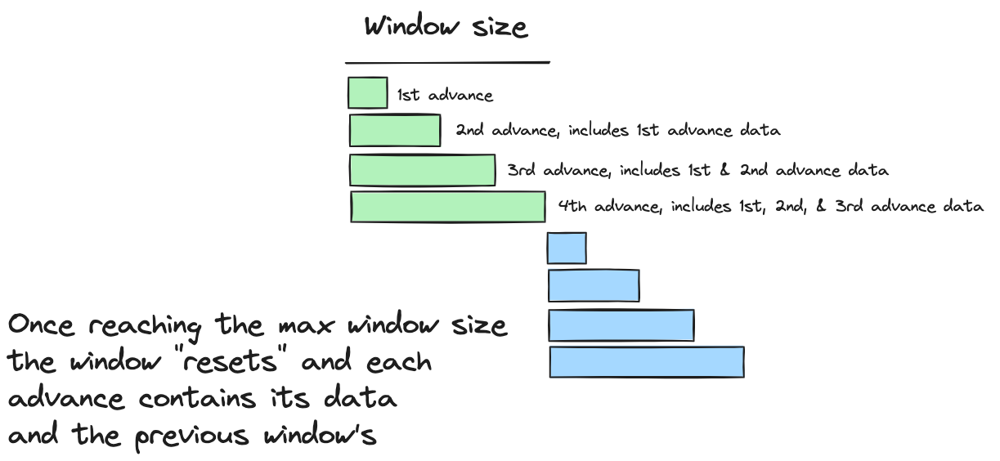
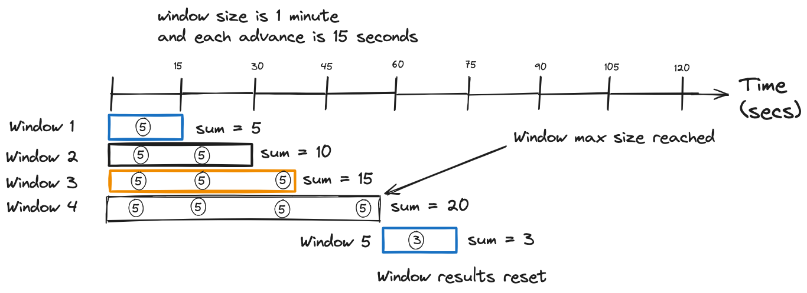
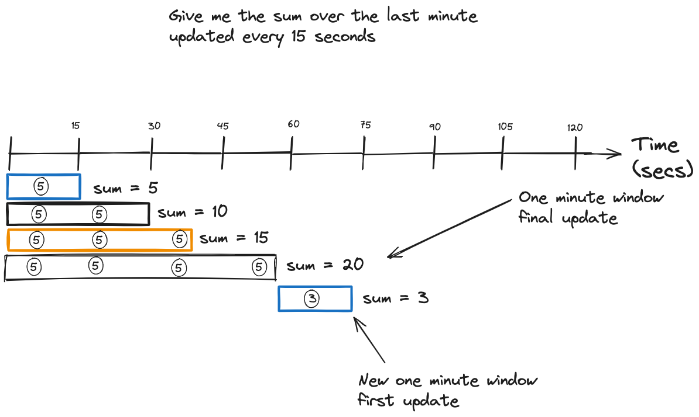
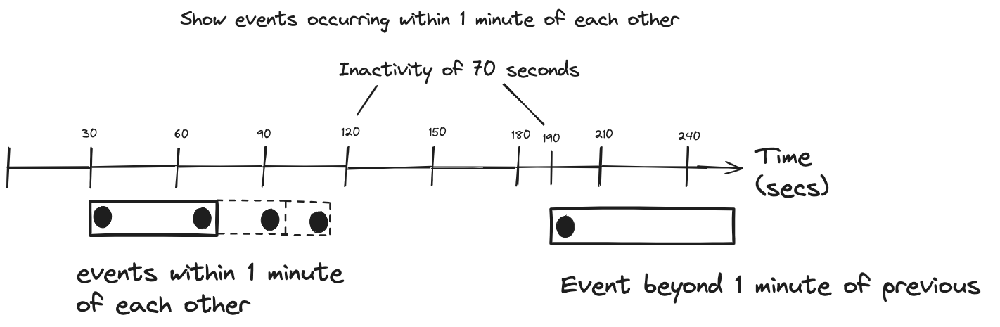

In the third installment of this windowing blog series, you’ll learn about cumulating and session windows. In previous posts, we’ve covered [hopping and tumbling windows](https://www.codingjunkie.net/mastering-stream-processing-hopping-tumbling-windows/) and [sliding windows and the Flink SQL equivalent - OVER aggregations](https://www.codingjunkie.net/mastering-stream-processing-sliding-windows/). The cumulate window is unique to Flink SQL. The session window has been available in Kafka Streams since version 0.10.2 and is going to be available in the newest version (1.19) of Flink SQL as part of its stable windowing table-valued functions (TVFs).

Before jumping in, if you ask yourself what is cumulating and how does that relate to Accumulating? The difference between cumulate to accumulate is that the latter is a more intentional gathering while cumulate means to gather together what you already have.

Now, let’s get into cumulating windows.

## Cumulating windows

The cumulate window is also part of Flink SQL’s windowing TVF stable and has a fixed size and steps that advance it. Each advance includes the data from the window start and each previous advance. Once the advances reach the window size, the data resets to only what is available at the beginning of the new window. This concept is probably best understood with an illustration:

<figure>

<figcaption>Cumulating windows have a fixed size with advances smaller than the length of the window</figcaption>
</figure>

So, from looking at this picture, each advance of the window includes all previous records from the window start. So, each advance accumulates the results up to the window end. Then, the window advances reset from the beginning of the newest window. Another way to think about the cumulate window is a tumbling window where you get updates at regular intervals.

This explanation could still leave some doubt about what the cumulating window does, so let’s look at one more illustration with values:

<figure>

<figcaption>A Cumulate window with a sum function</figcaption>
</figure>

Each event in above illustration represents a purchase transaction, and for simplicity of the example, let’s say each transaction is $5. At the window start, there is a transaction; with each slide, there’s an additional one. Since we have a window size of 1 minute with a 15-second step, our results are w1 = $5, w2 = $10, w3 = $15, w4 = $20. Each step includes the previous events from the overall window start. Once the window reaches its size, the results would reset to the beginning of the next window.

To use this functionality, specify the window type by using the reserved function name `CUMULATE` inside the `TABLE` function:

**Specifying the CUMULATE function**

    SELECT window_start,
           window_end,
           user_id,
           sum(page_view) AS page_views
    FROM TABLE(CUMULATE   <1>
                   (TABLE user_visits,   <2>
                         DESCRIPTOR(visit_time), <3>   
                         INTERVAL '15' SECONDS,  <4>
                         INTERVAL '1' MINUTE   <5>
                   ))
    GROUP BY window_start,
             window_end,
             user_id

Let’s break this query down:

1.  Using the `CUMULATE` function

2.  Specifying the table for the function source

3.  Timestamp column providing time attributes for the windows

4.  The step size of each advance

5.  Maximum size of the window

In an earlier post, I discussed how Kafka Stream windows emit updates regularly and Flink SQL windows only emit on closing. The functionality of a cumulating window is logically similar to the Kafka Streams windowing model since it emits updates before the final one. But there’s a difference: **Kafka Streams updates are tied to committing or cache eviction events and are not configurable**.

Now, let’s move on to session windows.

## Session windows

Session windows differ significantly from the previous ones we’ve seen so far in that they don’t have a fixed size. Instead, session windows define an *inactivity period*, and as long as records arrive within the inactivity period, a session window continues to grow. A new window starts only when a new record arrives and its timestamp is equal to or greater than the inactivity period plus the end timestamp of the current session. Due to the nature of session windows, the record timestamps determine the start and end of the window.

Let’s review this process in the following depiction of session windows:

<figure>

<figcaption>Session windows continue to grow until the gap between the latest and incoming timestamps exceeds the inactivity period</figcaption>
</figure>

So, following along with this illustration, the session window continues to grow until a record arrives with a timestamp 1 minute or more than the ending timestamp of the current session. With the arrival of this timestamp outside the inactivity gap, results in creating a new session.

## Kafka Streams Session Window

Here’s how you define a session window in Kafka Streams:

**Session windows in Kafka Streams**

     Serde<Windowed<String>> sessionWindowSerde =
          WindowedSerdes.sessionWindowedSerdeFrom(String.class); <1>
     builder.stream(inputTopic, Consumed.with(Serdes.String(), clicksSerde))
            .groupByKey()
            .windowedBy(SessionWindows.ofInactivityGapWithNoGrace ( <2>
                                                      Duration.ofMinutes(1) <3>
                                                  )
                        )
            .count()
            .toStream()
            .to(outputTopic, Produced.with(sessionWindowSerde, Serdes.Long()));

Let’s break it down step by step (btw, Serde here refers to Serializer/Deserializer! aha, welcome back to distributed systems world)

1.  Creating a `Serde` for session windows

2.  Specifying to use session windows for the aggregation. Here, we’re choosing not to use a grace period so that Kafka Streams will drop out-of-order records. In this series, we’ll discuss grace periods in the blog post on time semantics.

3.  The amount of inactivity, 1 minute, between events before the current session terminates and a new session starts.

## Session Windows in Flink SQL

To define a [session window in Flink SQL](https://nightlies.apache.org/flink/flink-docs-release-1.19/docs/dev/table/sql/queries/window-tvf/#session) you’ll use the windowing TVF format assuming the use case of tracking a click stream on a website:

**Session Windows in Flink SQL**

    SELECT window_start,
           window_end,
           COUNT(click) AS total_clicks
      FROM TABLE(SESSION     <1>
                   (TABLE page_views,  <2>
                    DESCRIPTOR(click_time), <3>
                    INTERVAL '1' MINUTES    <4>
                    )
                )
    GROUP BY window_start, window_end;

Let’s break it down step by step:

1.  Specifying the SESSION windowing TVF function

2.  Source table for events

3.  Time attribute column

4.  The inactivity gap for defining when to start a new session

## Use cases

### Cumulating Window

For the cumulate window, any windowed aggregation where you do a count or sum is the candidate use case.

<figure>

</figure>

We can generalize the cumulating window use case as **"Give me &lt;aggregate&gt; over the last N period, updated every Y."** Instead of waiting for the window to close, you can get updates to help you understand the trends leading up to the final window result.

### Session Window

For the session window, we could say, **"Show me &lt;aggregate&gt; of events occurring within &lt;inactivity period&gt;."** Since the session window starts and ends with event timestamps and continues to grow with incoming records within the inactivity gap, it lends itself well to tracking behavior.

<figure>

</figure>

Things like tracking a click stream come to mind. The first click event starts the window, and the session continues to grow until it doesn’t receive more events within the inactivity timeout. Then, when more events come in, a new session starts.

# Resources

-   [Kafka Streams in Action 2nd Edition](https://www.manning.com/books/kafka-streams-in-action-second-edition)

-   [Apache Flink® on Confluent Cloud](https://www.confluent.io/product/flink/)

-   [Flink SQL Windows](https://nightlies.apache.org/flink/flink-docs-release-1.19/docs/dev/table/sql/queries/window-tvf/#windowing-table-valued-functions-windowing-tvfs)

-   [Kafka Streams windowing documentation](https://docs.confluent.io/platform/current/streams/developer-guide/dsl-api.html#windowing)
