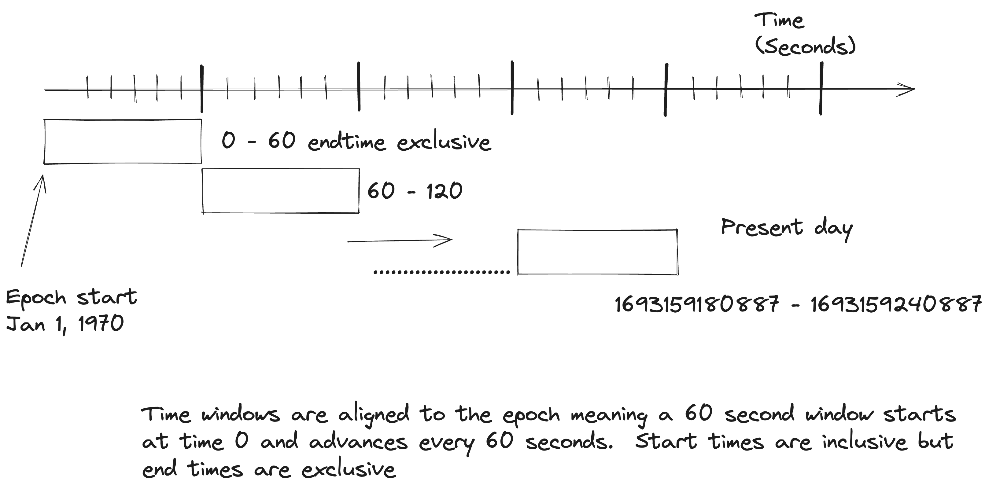
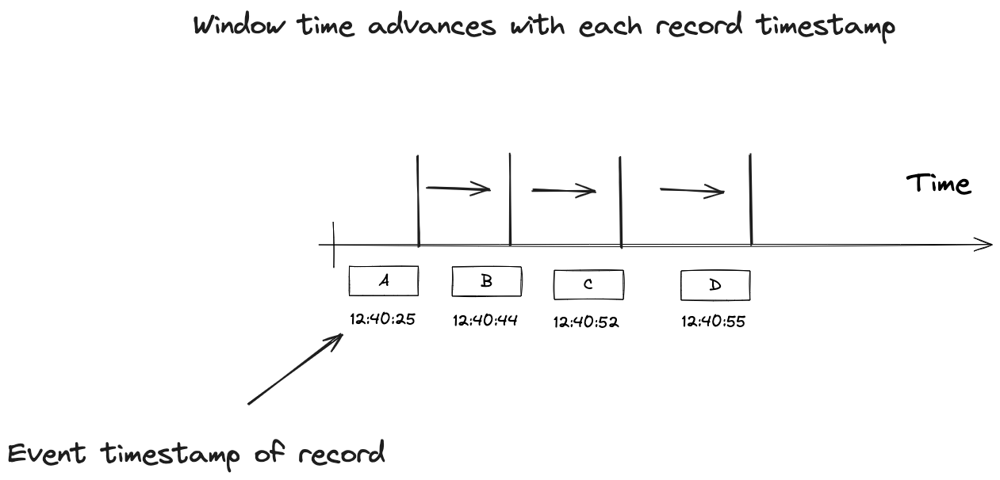
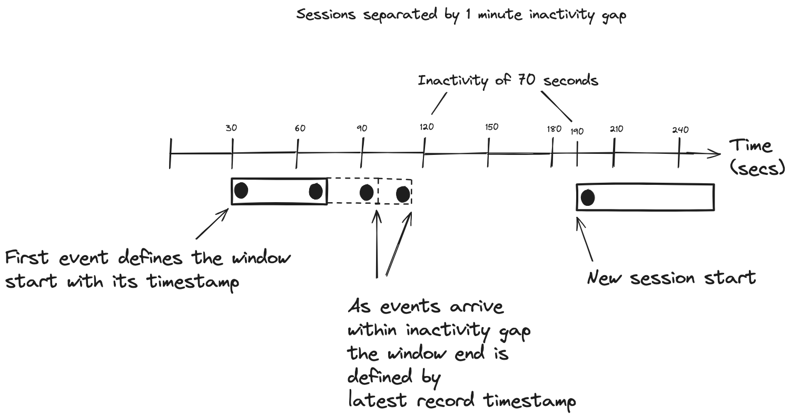
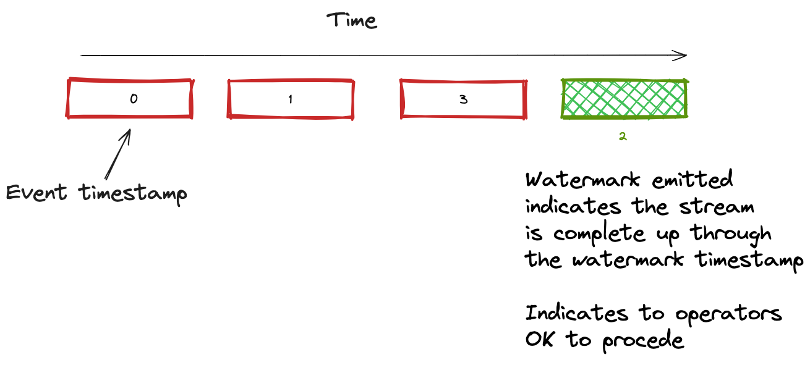
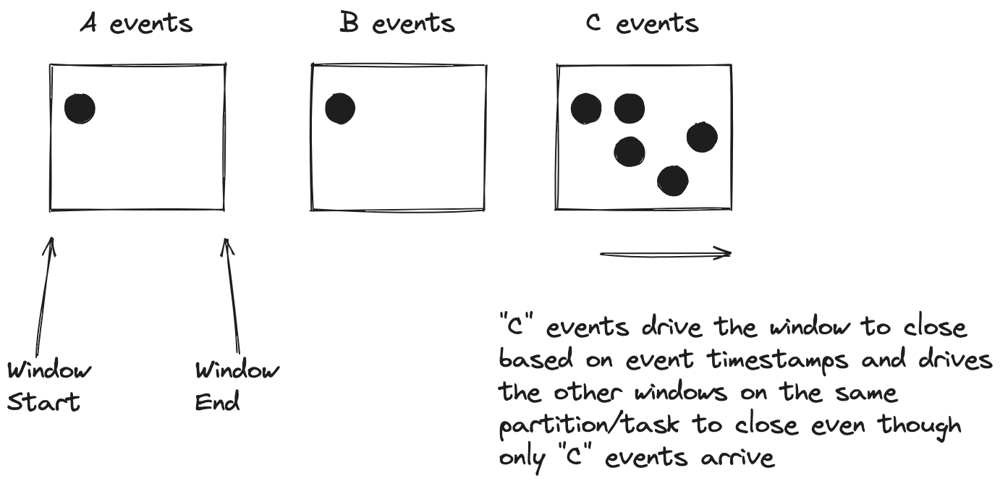

In the previous blog in this series, we wrapped up coverage of the different windowing types. Here is the list of earlier installments in this series:

1.  [Introduction to windowing](https://www.codingjunkie.net/introduction-to-windowing/)

2.  [Hopping and Tumbling windows](https://www.codingjunkie.net/mastering-stream-processing-hopping-tumbling-windows/)

3.  [Sliding windows and OVER aggregation](https://www.codingjunkie.net/mastering-stream-processing-sliding-windows/)

4.  [Session windows Cumulating windows](https://www.codingjunkie.net/mastering-stream-processing-session-cumulating-windows/)

In this post, we’ll move on from specific code examples and discuss the time semantics of window advancement and the forwarding of results. We’ve now discussed the different window types, how they function, and potential best use cases. But we’ve left some crucial questions unanswered. In this post, we’ll address the following questions:

1.  Time semantics and determining what time to use

2.  What determines when a window starts and ends?

3.  Extracting timestamps and how to handle time advancement?

4.  How do you handle out-of-order records?

# Determining the timestamp to use

Kafka Streams and Flink SQL use event timestamps, so they’re based on event time, not system time (although both systems allow configurations to use system time, but I won’t discuss that) . Event timestamps are the time the event occurred. In this blog post, we’ll define event timestamps as the time of the event, and it’s part of the record. System time is the current time of the stream processing engine and provides processing time semantics. We will focus on event-time semantics; later in this blog, we’ll discuss the mechanics of how the stream processing systems extract the event time and some related details. But for now, it’s enough to say the event timestamps drive windowing operations.

# Window start and end time

Record event timestamps are at the heart of windowing, but their involvement depends on the window type. Hopping, Tumbling, and Cumulative windows are aligned to the epoch, starting on January 1, 1970. What does aligned to the epoch mean exactly? Let’s answer that question with the help of an illustration:

<figure>

<figcaption>Windows aligned to the epoch collect records that fit into the correct slot</figcaption>
</figure>

From this illustration, a five-minute tumbling window starts at 00:00:00 on January 1, 1970. Then, every five minutes, a new window is created (logically) up to the present moment. So when a new record arrives, its event timestamp isn’t the window start time but determines *\*which\** window it belongs to. Time advances in these windows as the event timestamps of the incoming records increase. The following graphic helps demonstrate this process:

<figure>

<figcaption>Time for a window advances as event timestamps increase</figcaption>
</figure>

So, once a record arrives with a timestamp greater than the current window end, a new window is built, either by an advance time or window size, depending on whether the window is hopping or tumbling. This advancement description does not account for out-of-order records; we’ll get to that later.

Session and sliding windows (Kafka Streams version of sliding windows) are more behavior-driven and have different semantics. Session windows use the event timestamps to start and close windows. When the first record arrives for a session window, its timestamp becomes the start of the window. Once a record arrives where the timestamp difference exceeds the inactivity gap (accounting for any grace period), a new session starts. The following picture will help in understanding this process:

<figure>

<figcaption>Session windows use event timestamps for opening and closing times</figcaption>
</figure>

From this illustration, the session start time is the timestamp of the first record, and the ending time is the timestamp of the last record included in the session. To be more precise, with session windows in Kafka Streams, when a new record arrives, it creates a new window for the record. Kafka Streams then looks to merge that new session window with an existing session. If the new session window’s start timestamp is within the existing session window’s ending timestamp plus the inactivity gap, Kafka Streams will merge the new session into the existing one. This process of merging sessions is how they continue to grow with events inside the inactivity gap. This merging process accounts for out-of-order records that could connect two older sessions into a single larger one.

Sliding windows in Kafka Streams have a fixed size, specified by the maximum difference between incoming events. But it uses event timestamps like the session window for window start and ending.

Now that we’ve discussed how the opening and closing of windows operate let’s move on to time advancement.

# Time Advancement

For a window’s time to advance, there needs to be some mechanism to extract an event timestamp from a record and apply it so that time will move forward. Kafka Streams and Flink SQL handle this differently, but the results are the same.

## Kafka Streams time advancement

Kafka Streams uses a [TimestampExtractor](https://kafka.apache.org/36/javadoc/org/apache/kafka/streams/processor/TimestampExtractor.html) to get the event timestamp. By default, it will extract the timestamp from the consumer, set by the producer. If you prefer to use a timestamp embedded in the record payload, you can write a custom `TimestampExtractor`, which "knows" which field to grab and use for the timestamp. Kafka Streams keeps track of the highest observed timestamp on a per-partition basis. This current highest timestamp is known as "streamtime" and only moves forward. When an out-of-order record arrives, the streamtime remains unchanged. We’ll discuss out-of-order records later on. Let’s look at an illustration of the concept of streamtime:

<figure>

<figcaption>Kafka Streams keeps track of timestamps known as stream time</figcaption>
</figure>

So, as Kafka Streams consumes records, it checks the timestamp of the current record, and if it exceeds the current time, Kafka Streams updates streamtime. Kafka Streams share the timestamp of the current record via a record context that accompanies each record as it flows through the topology. Each window operator keeps track of streamtime itself, and when it advances due to the event timestamps, Kafka Streams will close existing windows where time has advanced beyond its size and or create new windows. Suppose the difference between streamtime and the current timestamp exceeds the inactivity gap for session windows. In that case, Kafka Streams will not merge the new session into the existing one but use it to start a new session.

For all stateful operations in Kafka Streams, windowed results are buffered and released incrementally, either on commit or when its local cache is full. If you want only to receive a final result, you can set the [EmitStrategy](https://kafka.apache.org/36/javadoc/org/apache/kafka/streams/kstream/EmitStrategy.html) on the window to `ON_WINDOW_CLOSE`. Here’s the tumbling window example configured only to emit a final result:

**Tumbling window with only final results**

```java
    KStream<String,Double> iotHeatSensorStream =
      builder.stream("heat-sensor-input",
        Consumed.with(stringSerde, doubleSerde));
    iotHeatSensorStream.groupByKey()
          .windowedBy(TimeWindows.ofSizeWithNoGrace(Duration.ofMinutes(1)))
            .emitStrategy(EmitStrategy.onWindowClose())  <1>
            .aggregate(() -> new IotSensorAggregation(tempThreshold),
             aggregator,
             Materialized.with(stringSerde, aggregationSerde))
             .toStream().to("sensor-agg-output",
               Produced.with(windowedSerde, aggregationSerde))
```

1.  Specifying only emit results after the window closes

Using an `EmitStrategy.onWindowClose()` is an efficient approach for working with sliding windows, as it will have several updates due to the 1MS window advancement.

Now, let’s look at time advancement in FLink SQL.

## Flink SQL time advancement

Logically, Flink time advancement works in the same way. It looks to extract the event timestamp from the incoming records. To do this event timestamp extraction, you provide a `TimestampAssigner`. But instead of the concept of streamtime for event time progression, Flink uses watermarks. A watermark is an assertion that the stream is now complete up through the timestamp the watermark carries. Here’s an illustration showing the watermark process:

<figure>

<figcaption>Flink SQL uses watermarks to indicate to downstream operators what the current event time is</figcaption>
</figure>

So, as you can see in this illustration, Flink operators will use the watermark timestamp to advance windows or close and open new ones. Flink only emits windowed results after a window closes due to a watermark advancing the window beyond its configured size.

In the [Flink Data Stream API](https://nightlies.apache.org/flink/flink-docs-release-1.19/docs/dev/datastream/event-time/generating_watermarks/), you’ll set the `TimestampAssigner` and `WatermarkGenerator` together with a `WatermarkStrategy`. But we’re focusing on Flink SQL, so you’ll specify a watermark strategy as a statement when you issue a `CREATE TABLE` statement.

Consider this table definition tracking movie ratings entered by a user on a review site:

**Flink SQL table definition with watermark strategy**

```sql
    CREATE TABLE ratings (
        rating_id INT,
        title STRING,
        release_year INT,
        rating DOUBLE,
        rating_time TIMESTAMP(3), <1> 
        WATERMARK FOR rating_time AS rating_time <2>
    )
```

1.  Timestamp of the movie rating event

2.  Specifing to use the `rating_time` column as the watermark timestamp

Flink SQL specifying the watermark strategy takes the form of `WATERMARK FOR` &lt;column with timestamp&gt; `AS` &lt;watermark strategy expression&gt;. The watermark strategy depicted here is `Strictly ascending timestamps` and will forward the maximum observed timestamps. Flink SQL will evaluate the watermark strategy for each incoming record and periodically emit one as defined by the [pipeline.auto-watermark-configuration](https://nightlies.apache.org/flink/flink-docs-release-1.18/docs/deployment/config/#pipeline-auto-watermark-interval) which has a default value of 200ms. Flink will only emit a watermark if the current watermark is larger than the previous one. It doesn’t forward one if it is smaller (or null). It’s worth noting the timestamp column needs to be a `TIMESTAMP(3)` or `TIMESTAMP_LTZ(3)` type, where the 3 represents the precision of fractional seconds. In this case, it’s millisecond precision.

Another common element with stream time and watermarks is that advancing time affects all keys in a partition (Kafka Streams) or task slot (Flink SQL). Let’s take a look at an illustration to help understand what this means:

<figure>

<figcaption>Advancing time affects all keys per partition or task slot</figcaption>
</figure>

As you can see, we have three keys, A, B, and C, with roughly the same start time for their respective windows. When time advances due to an incoming record, C closes its window and closes the windows for A and B even though they do not have any new records. This action is an example of time advancement influencing all keys per partition/task slot.

Under ideal circumstances (an evenly distributed key space and a consistent flow of records), this time advancement should be fine because all the keys equally drive time advancement. However, an uneven distribution of keys combined with out-of-order records could cause issues where the window advances and closes, not including records that would otherwise be in the window. Configuring a grace period is one way to ensure that a larger key space doesn’t drive the window closing without skipping valid records because even though they arrive out of order, the grace period ensures their inclusion in the windows. We’ll cover grace periods and out-of-order data in the next section.

# Out of order data

So far, with our discussion of windowing, I’ve assumed the happy path of records arriving in order, that is, strictly ascending timestamps. But in practice, a record may arrive out-of-order. Let’s look at an illustration to help explain what an out-of-order record is:

<figure>

<figcaption>An out-of-order record would have been included in a window if it arrived in order</figcaption>
</figure>

This illustration shows us that an out-of-order record would have been included in a now-closed window had it arrived in order. Given that we want our windowed results to have as complete a picture as possible, making allowances for out-of-order data makes sense. You should allow a grace period, where a window can include records it would otherwise reject. In Kafka Streams, you can explicitly add a grace period to a window definition:

**Adding grace to Kafka Streams window operator**
```java

    KStream<String,Double> iotHeatSensorStream =
      builder.stream("heat-sensor-input",
        Consumed.with(stringSerde, doubleSerde));
    iotHeatSensorStream.groupByKey()
          .windowedBy(TimeWindows.ofSizeAndGrace(Duration.ofMinutes(1),Duration.ofSeconds(30))) <1>
            .emitStrategy(EmitStrategy.onWindowClose())
            .aggregate(() -> new IotSensorAggregation(tempThreshold),
             aggregator,
             Materialized.with(stringSerde, aggregationSerde))
             .toStream().to("sensor-agg-output",
               Produced.with(windowedSerde, aggregationSerde))
```

1.  Defining a tumbling window of one minute with thirty seconds grace.

The grace period works like this. When a window operator evaluates if it should include the current record, it will subtract the grace period time from the current stream time value. It will be included if the record’s timestamp fits into the grace-adjusted time for the window. Here’s a quick depiction of a grace period in action:

<figure>

<figcaption>Grace period in action</figcaption>
</figure>

So, by defining a grace period, you can include records that arrive out of order. Any records arriving after the grace period expiration are considered late and are discarded.

Flink SQL also makes provisions for out-of-order records that operate in a similar manner. You would adjust the watermark strategy expression to allow for out-of-order records:

**Flink SQL table definition with watermark strategy expression with a grace period**
```sql
    CREATE TABLE ratings (
        rating_id INT,
        title STRING,
        release_year INT,
        rating DOUBLE,
        rating_time TIMESTAMP(3),
        WATERMARK FOR rating_time AS rating_time - INTERVAL '30' SECOND <1>
    )
```

1.  This watermark strategy allows records in the ratings table to be as much as 30 seconds out-of-order.

Updating the watermark strategy this way makes it "Bounded out of orderness timestamps". So when a record arrives out of order, but its timestamp still fits inside the current watermark, it will be included in the windowed calculation.

# Time and Low traffic partitions

Another angle of time semantics relates equally to Kafka Streams (stream time) and Flink SQL (watermarks) that I’d like to cover before wrapping up: behavior with low traffic partitions. I had mentioned before that with both Kafka Streams and Flink SQL, the event time of the incoming records drives the progress of the event stream.

But what happens when you have low or infrequent traffic? You’ll not observe windowed results regularly without new events to push time advancement. Flink SQL has the concept of "idleness" that allows time to advance when faced with a task slot not receiving regular new events. The [table.exec.source.idle-timeout](https://nightlies.apache.org/flink/flink-docs-stable/docs/dev/table/config/#table-exec-source-idle-timeout) or [sql.tables.scan.idle-timeout](https://docs.confluent.io/cloud/current/flink/reference/statements/set.html#available-set-options) on [Confluent Cloud](https://www.confluent.io/product/flink/) lets you specify an upper bound on the amount of time to wait for new records before considering a task slot as idle. Setting this configuration (the default is 0, which turns off detecting idleness) allows downstream operators to advance watermarks, providing windowed results without waiting for new records from the event source. You can offer similar functionality in Kafka Streams with a bit of manual work using the [KStream.process](https://javadoc.io/static/org.apache.kafka/kafka-streams/3.6.1/org/apache/kafka/streams/kstream/KStream.html#process-org.apache.kafka.streams.processor.api.ProcessorSupplier-java.lang.String…​-) method. This method provides for a mixin of the [Processor API](https://docs.confluent.io/platform/current/streams/developer-guide/dsl-api.html#streams-developer-guide-dsl-process) openting the door to schedule a [punctuation](https://kafka.apache.org/36/javadoc/org/apache/kafka/streams/processor/ProcessorContext.html#schedule(java.time.Duration,org.apache.kafka.streams.processor.PunctuationType,org.apache.kafka.streams.processor.Punctuator)) which would allow you retrieve and forward windowed results with an idle partition.

# Resources

-   [Kafka Streams in Action 2nd Edition](https://www.manning.com/books/kafka-streams-in-action-second-edition) book.

-   [Apache Flink® on Confluent Cloud](https://www.confluent.io/product/flink/)

-   [Flink SQL Windows](https://nightlies.apache.org/flink/flink-docs-release-1.18/docs/dev/table/sql/queries/window-tvf/#windowing-table-valued-functions-windowing-tvfs)

-   [Kafka Streams windowing documentation](https://docs.confluent.io/platform/current/streams/developer-guide/dsl-api.html#windowing)
