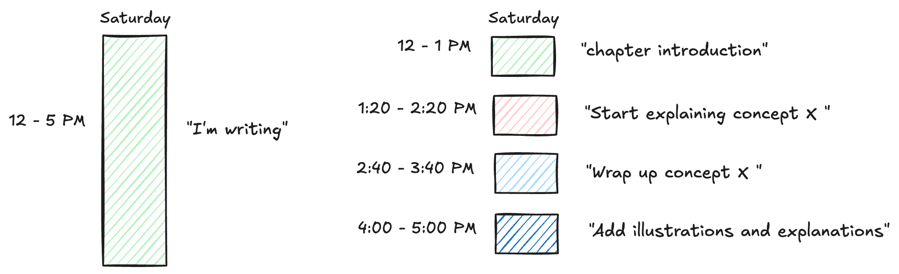
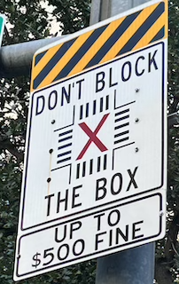

Earlier this year, I completed the 2nd edition of [Kafka Streams in Action](https://www.amazon.com/Kafka-Streams-Action-Second-Bejeck/dp/1617298689/).  Even though it's a second edition, there were several things I wanted to change from the first edition, so it ended up being mainly a complete rewrite.  Writing a book is a significant undertaking, and while it's probably the most challenging task I've ever undertaken, it was gratifying.  I don't regret the amount of time I spent working on it.  I learned several lessons along the way that I'd like to share in the hopes that someone else will benefit from my experience (if anything, writing about it will help solidify the information for myself).   I have several points I'd like to discuss: 

  - Yes, Virginia, you need a schedule plan
  - Have a good yardstick
  - The magic of 100 words 
  - Objects in the mirror are smaller than they appear
  - No matter what, never block
 
With the introduction out of the way, let's get started.

# Yes, Virginia, you must have a plan
 
The need for planning was probably my biggest surprise during the process.  While the need for planning might seem obvious to some, to me, it was a revelation.  I held the mistaken belief that I would simply sit down with the intent to write, the inspiration would start flowing, and my fingers would begin to furiously pound on the keyboard.  

Additionally, I was sure that my productivity was linear; the more time I had, the more I'd get written.  I quickly found those beliefs couldn't be further from the truth.  My actual experience looked like sitting down, distracted, and not knowing what I wanted to say.  I'd get a few words down, and my mind would drift, and then inevitably, I'm surfing on the internet looking at things that couldn't be further from what I'm writing about ("What happended to the cast of [Gilligan's Island](https://en.wikipedia.org/wiki/Gilligan%27s_Island)?")  It seemed the more time I had, the *__less__* I accomplished.

This large block of time/low productivity scenario could be attributed to an issue known as Parkinson's Law:

> Work expands so as to fill the time available for its completion
> -- <cite>C. Northcote Parkinson</cite>[^1]
> 

[^1]:[Parkinson, Cyril Northcote (19 November 1955). "Parkinson's Law". The Economist. London.](https://www.economist.com/news/1955/11/19/parkinsons-law)

In other words, if you allow yourself a large block of time without specific plans or goals, there's a high chance you'll use the entire time and achieve very little.  

So what's the solution to this less than ideal working situation?  Planning and setting a schedule with deadlines.  While many of us [resist setting deadlines, the bottom line is they work](https://theengineeringmanager.substack.com/p/parkinsons-law-its-real-so-use-it).  Consider the following illustration
<figure>
  
  <figcaption>Schedule defined blocks of time for a specific tasks vs. large blocks with no goal</figcaption>
</figure>

The main idea is that instead of a big block of time to get something done, you need to set _smaller_ amounts of time with a defined outcome.  The size of the work blocks and break time shown here are arbitrary.  Still, I would recommend blocks of [60-90 minutes](https://www.supernormal.com/blog/how-to-schedule-focus-time#:~:text=How%20long%20should%20focus%20sessions,to%20deliver%20the%20best%20results.).  It's also essential to allow for some time, in the beginning, to get into the "flow," it's nearly impossible to sit down to write and be productive immediately.  A good resource for establishing a work-break process is the [Pomodoro&reg; technique](https://www.pomodorotechnique.com/)  

# Have a good yardstick

Along with having a good schedule, I found having concrete markers to measure my progress invaluable.  Being able to gauge your progress goes hand-in-hand with establishing a good schedule.  For me, it was counting the number of words (exclusive of code examples) written.  For [Kafka Streams in Action](https://www.amazon.com/Kafka-Streams-Action-Second-Bejeck/dp/1617298689/), the publisher guidelines set each chapter at roughly 30 pages.  At 30 pages, I'd have about 9,000 words.  My goal was to produce a new chapter every 3 weeks.  To achieve that pace, I determined I'd need to write 500 words daily, 6 days a week (one day off is essential).  I'd produce 3,000 words weekly at that pace, resulting in a new chapter every 3 weeks.  While my progress was not always linear, it allowed me to assess my productivity accurately.  More importantly, it would help me adjust my schedule when the inevitable life interruptions occur.  Not able to write for 2 days this week?  It's not a big deal.  Just up my word count on two other days to 1,000 or 750 words per day for four days, and I'd still be on track.  Of all my heuristics, standardizing how I was making progress was one of the most important.  The ability to "commoditize" your time into blocks allows you to schedule more effectively and fit writing into your schedule vs. having writing take over your schedule.

# The magic of 100 words

No matter how motivated you are as a writer or excited about your topic, inevitably, you'll face times when you flat out don't feel like writing.  While it's natural to take a break here and there, if you give in to the emotion of not writing too often, you can quickly fall even further behind on your schedule, which can lead to increased discouragement.  The problem of waiting until you feel like doing something is that feeling may never come.  While willpower can sometimes help with motivation, it's not a long-term solution.  While I tried a few different approaches, what ended up working for me was to set a very small goal: just write 100 words.  Setting this small goal helped me overcome my writing inertia and have a productive session.  Now, it doesn't always need to be a word-count goal, but the idea is to set a small, achievable goal before giving in to the "I just don't feel like writing" vibe.  More often than not, this little trick will help you get going when the motivation is lacking.

# Objects in the mirror are larger than they appear

Writing a book is a considerable project.  There's so much ground to cover, spanning several months and even years.  Taking on something of this size, it's easy to get overwhelmed by the volume of work that needs to be done.  But thinking of the entire scope of work is counterproductive, and doing so, it's easy to get into a "deer in the headlights" mode where you're overwhelmed and not making progress.  This is true of any large project, not only writing a book.  In a bit of a twist on everything we've spoken about so far, the key is to break things down into smaller, manageable pieces.  Switching your focus to each minor part makes things look much more manageable.  Then, before you know it, you'll string together several smaller parts into a larger whole.

# No matter what, never block

<figure>
  
</figure>

This section could alternatively be called “Always make progress”.  Of all the topics I’ve touched on in this blog post, this one could be the most important.  Over time, you’ll find that even when applying different strategies, there will be periods when it’s tough to get anything done.  Whether it’s work/family obligations or something else, life will get in the way.  When you encounter such a period, it’s imperative for you to continue to make progress.  The significant danger with stopping is that it’s much harder to get going again.  

So when those tough times come, it is far better to write something small daily and continue to make some progress until you can get back to devoting more time to writing.  Other times, you’ll be the obstacle.  Let’s face it: You can apply all the strategies but are just out of steam.  At those moments, it’s important to remember that making progress without writing is still possible.  Maybe you have some illustrations to work on or do some additional research.  Since I was writing a technical book, I would write code for examples or lay out a concept for something I wanted to cover later.  Whatever you do isn’t that important as long as you continue to move forward.

## Acknowledgements

I would be remiss in my writing if I didn't acknowledge some sources for this blog post.  First, I must mention my excellent editor [Frances Lefkowitz](https://www.franceslefkowitz.net/), who taught me a lot about these writing concepts.  Secondly, the book [The Clockwork Muse](https://www.amazon.com/Clockwork-Muse-Practical-Writing-Dissertations/dp/0674135865) is an invaluable resource.

 